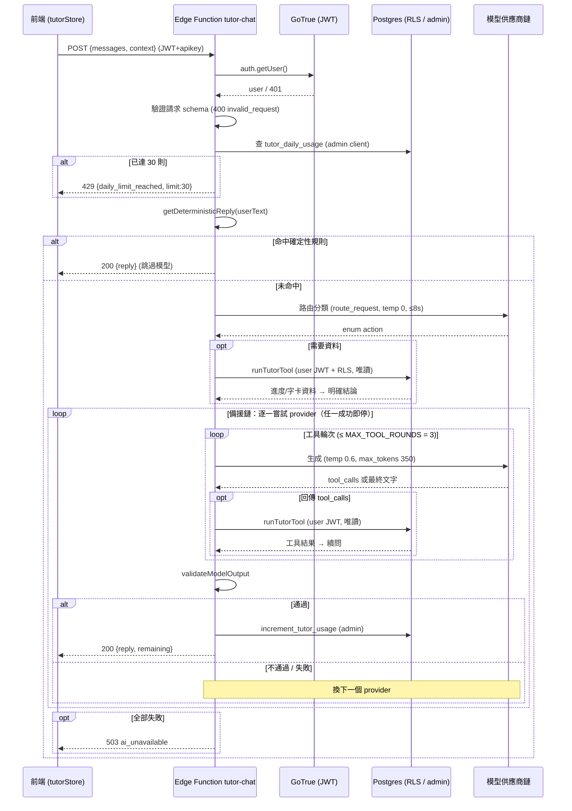

# Polaris AI 英文家教 Agent — 系統設計文件（SSD）

> 本文件描述 Polaris agent **怎麼實作、架構長怎樣**（how）。
> 「要做什麼、需求與驗收標準」（what）請見 spec：[`../specs/2026-06-29-polaris-agent-spec.md`](../specs/2026-06-29-polaris-agent-spec.md)

| 項目 | 內容 |
|---|---|
| **日期** | 2026-06-29 |
| **狀態** | 核心已實作並驗證：Edge Function + 真實 DB E2E 通過；紅隊 24/24；進度權威化安全驗證通過。韌性與可觀測性（見 §13）為**已知待辦**。 |
| **主要程式** | `backend/supabase/functions/tutor-chat/index.ts` |

---

## TL;DR — 一分鐘理解

- **Polaris 是什麼**：Notch Up! App 內建的 AI 英文家教。使用者透過右下角浮動按鈕（FAB）開啟全螢幕聊天，做多輪英文練習、即時糾錯，並詢問自己的學習進度、字卡與課程主題。
- **核心設計哲學**：**在不可靠的免費 LLM 上，做出可靠的 agent 行為。** 因為免費模型會幻覺、會被 prompt injection、會限流，整個 agent 被設計成一層層把不可靠模型包成可靠行為的 **harness**（防護外殼）。
- **一條信任邊界貫穿全設計**：**使用者輸入不可信、模型輸出不可信，只有後端經過驗證的資料可信。**
- **事實絕不幻覺**：所有進度數字唯一可信來源是後端唯讀查 DB（router + tool-calling），前端不送任何進度數字，模型碰不到 DB。
- **關鍵特性**：確定性攔截 → 意圖路由 → 後端唯讀工具 → 生成 → 多層輸出驗證，外層再套一條多模型降級的備援鏈；免費不扣點但有每日 30 則上限防濫用。

---

## 目錄

1. [概述與目標](#1-概述與目標)
2. [決策摘要](#2-決策摘要)
3. [系統架構](#3-系統架構)
4. [請求／回應合約](#4-請求回應合約)
5. [前端設計](#5-前端設計)
6. [後端 Edge Function 設計](#6-後端-edge-function-設計)
7. [記憶與狀態模型](#7-記憶與狀態模型)
8. [安全與信任邊界](#8-安全與信任邊界)
9. [資料模型](#9-資料模型)
10. [失敗模式](#10-失敗模式)
11. [部署與環境變數](#11-部署與環境變數)
12. [評測](#12-評測)
13. [已知限制與 Roadmap](#13-已知限制與-roadmap)
14. [檔案索引](#14-檔案索引)
- [附錄：常數一覽（附 file:line）](#附錄常數一覽附-fileline)

---

## 1. 概述與目標

> 本章說明 Polaris 是什麼、要解決什麼問題，以及要達成的具體目標。

Polaris 是 Notch Up! 內建的 **AI 英文家教 agent**。使用者透過全 App 右下角浮動按鈕開啟多輪對話，練習英文、即時糾錯，並詢問自己的學習進度、字卡與課程主題。

### 1.1 設計核心命題

> **在不可靠的免費 LLM 上，做出可靠的 agent 行為。**

因採用免費模型（會幻覺、會被 prompt injection、會限流），整個 agent 被設計成一層層把不可靠模型包成可靠行為的 harness，圍繞一條清楚的**信任邊界**：

> **使用者輸入不可信、模型輸出不可信，只有後端經過驗證的資料可信。**

### 1.2 目標

- 全 App 可用的多輪英文練習對話（糾錯、更道地說法、鼓勵）。
- 回答個人化學習狀態問題（第幾天、漏掉哪天、完成率、字卡精熟、本週主題）。
- 事實（尤其進度數字）**絕不幻覺**：唯一可信來源是後端唯讀查詢。
- 防越獄 / prompt injection / 簡體字 / 內部指示洩漏。
- 免費、不扣點，但有每日上限防濫用；後端介面預留可一行切換付費模型。

---

## 2. 決策摘要

> 本章一頁列出所有關鍵設計決策與理由，作為全文導覽。

| 項目 | 決定 | 說明 |
|---|---|---|
| Agent 型態 | 多輪對話聊天室 | — |
| 擺放位置 | 右下角 FAB + 全螢幕 Modal | 掛在 `TabNavigator.tsx` 的 `TabNavigatorInner`，位於 `SafeAreaView` 內、`content` View 之後、絕對定位覆蓋全 App（`TabNavigator.tsx:160-166`） |
| 計費 | 免費不扣點 + 每人每日 30 則上限（UTC+8 重置） | 後端介面預留可一行切換付費模型 |
| 對話紀錄 | 純記憶體，不落地；App 重啟即清、跨日自動清空 | 隱私優先 |
| 串流 | 不做 streaming，一次性回傳 | 簡化實作 |
| App 狀態感知 | **後端工具唯讀查 DB**（router + tool-calling） | 前端 context 不可信、弱模型會照著幻覺，故事實一律由後端權威查證 |
| context 傳遞方式 | 放**獨立 system message**，非塞進 user 訊息 | 模型當背景脈絡處理、乾淨、易停用／截斷（`index.ts:610-613`） |
| 進度數字可信度 | **後端 `computeProgress()` 權威計算**，前端不送進度數字 | 唯一可信來源是後端，杜絕前端偽造 |
| 模型供應商 | **Groq 免費層為主，OpenRouter 免費為最後備援** | 見 §2.1 模型選型 |
| 防護層 | 確定性攔截 + 多層輸出驗證 + 今日一致性守門 | 免費模型不可靠，把安全與 grounding 放程式層而非只靠 prompt |

### 2.1 模型選型

- 主力採 **Groq 分層備援鏈**（見 §6.6，低延遲），OpenRouter 免費為最後備援；以「多模型降級」補免費層無 SLA 的可靠度。
- **選型準則**：
  - 避免「先輸出推理過程」的重推理模型（即時聊天慢且冗長）。
  - 避免匿名 stealth、會記錄使用者對話的模型（不適合上架 App）。
  - 優先選 Apache 2.0 授權 / 知名供應商、可調推理深度以壓低聊天延遲。

---

## 3. 系統架構

> 本章由外而內描述元件、資料流、後端控制流與請求時序。

### 3.1 元件與資料流

```
[TutorFab] --tap--> [TutorChatModal] --sendMessage--> [tutorStore (zustand)]
                                                          |
                                     buildLearningContext()（僅今日教學脈絡，無進度數字）
                                                          |
              正式路徑：fetch /functions/v1/tutor-chat  (Authorization: Bearer JWT + apikey: anon)
              proxy 路徑：fetch $EXPO_PUBLIC_TUTOR_PROXY_URL/tutor-chat（僅 Content-Type，跳過登入，見 §11）
                                                          |
                                        [Edge Function: tutor-chat]  ← 見 §6
                                                          |
                                          { reply, remaining }  或  error
```

**進度即時性路徑**：使用者在 Schedule「劃一刀」→ `progressStore.toggleDay()` → **立即** sync 到 `/functions/v1/progress-sync` → 寫 `user_progress` → tutor 工具下次即讀到最新進度（即時性基礎，見 §7）。

### 3.2 後端控制流（agent 核心）

一次請求依序經過五個階段，外層再套一條模型備援鏈：

```
使用者訊息
   │
   ▼ ① 確定性攔截 (getDeterministicReply)              不進模型；命中即回、reply 定值
   │   安全(自傷/藥物過量/胸痛)、高頻文法錯、已知越獄/洩漏請求、代寫、跨使用者資料…
   │   ※ 命中時 route 設為 null，但因 reply 已有值，生成迴圈 (§6.6) 為空、直接跳到用量累加
   │ 未命中
   ▼ ② 意圖路由 (routeTutorRequest)                    一次 LLM，temperature 0，enum，逾時 min(t,8s)
   │   → get_learning_progress / get_flashcard_stats / get_practice_flashcards / respond_directly
   │
   ├─ respond_directly ───────────────────────────┐
   │                                               │
   ▼ 需要資料                                       │
   ③ 後端唯讀執行工具 (runTutorTool)                 │  使用者 JWT + RLS；模型碰不到 DB
   │   查真實 DB → computeProgress() → 判讀成「明確結論」(僅 progress route)
   │ 可信資料當獨立 system message 餵回
   ▼                                               ▼
   ④ 生成 (agent loop，每 provider 獨立對話副本)      temperature 0.6，max_tokens 350
   │   支援工具的 provider 且 route==null 且無 trusted data → 標準 tool-calling loop（MAX_TOOL_ROUNDS=3）
   │   空回覆 / 非 200 → break 換下一個 provider
   │
   ▼ ⑤ 多層輸出驗證 (validateModelOutput)             沒過就換下一個 provider 重跑
   │   簡體字 / prompt洩漏 / 內部推理 / 幻覺數字 / 越獄 / 今日完成一致性 …
   │ 通過
   ▼
   回覆 + 原子累加每日用量 (increment_tutor_usage)；所有 provider 皆失敗 → 503

※ ②③④⑤ 外層包「模型備援鏈」：Groq 70B → 8B → gpt-oss-20b → qwen3-32b → OpenRouter free，任一失敗降級。
```

### 3.3 請求時序圖



---

## 4. 請求／回應合約

> 本章定義前端與 Edge Function 之間的 API 介面：端點、標頭、請求格式、驗證規則與錯誤碼。

**端點**：`POST /functions/v1/tutor-chat`

**Headers（正式路徑）**：

- `Authorization: Bearer <JWT>`
- `apikey: <anon>`
- `Content-Type: application/json`

（proxy 路徑僅帶 `Content-Type`，不帶 Authorization / apikey — 見 §11）

**Request body**：

```jsonc
{
  "messages": [ { "role": "user"|"assistant", "content": "..." } ],  // 1–20 則；最後一則必須 role=user
  "context": "【學生目前的學習狀態…】\n- 今天：…\n- 本週主題：…"        // 選填；僅教學脈絡
}
```

**請求驗證**（任一不符 → `400 invalid_request`，`index.ts:485-490`）：

- `messages` 非陣列 / 空 / 超過 20 則。
- 最後一則非 `user`。
- 任一則 `isValidMessage` 失敗（角色須 `user|assistant`、content 非空且 ≤ 2000 字）。
- `isSuspiciousAssistantHistory` 命中（偽造含越獄字樣的 assistant 歷史）。
- `isValidLearningContext` 失敗。

**Response / 錯誤碼**：

| 狀態 | body | 情境 |
|---|---|---|
| 200 | `{ reply: string, remaining: number }` | 成功 |
| 401 | `{ error: 'unauthorized' }` | 無 Authorization 或 JWT 無效 |
| 405 | `{ error: 'method_not_allowed' }` | 非 POST |
| 400 | `{ error: 'invalid_json' }` | body 非合法 JSON |
| 400 | `{ error: 'invalid_request' }` | schema 驗證失敗 |
| 429 | `{ error: 'daily_limit_reached', limit: 30 }` | 當日已達上限 |
| 503 | `{ error: 'ai_unavailable' }` | 所有 provider 皆失敗 / 被驗證擋下 |
| 500 | `{ error: 'internal_error' }` | 未預期例外 |

---

## 5. 前端設計

> 本章說明前端各檔案的職責，以及對話不落地、樂觀 UI 等前端行為。

### 5.1 檔案職責

| 檔案 | 職責 |
|---|---|
| `app/src/components/TutorFab.tsx` | 浮動按鈕 |
| `app/src/components/TutorChatModal.tsx` | 全螢幕聊天 Modal；starter chips、**Markdown 粗體渲染 `renderRich`**（模型用 `**…**` 標正確說法 → 金色粗體）、老師訊息長按 TTS、每日剩餘 badge、常駐隱私列、錯誤／重試 UI |
| `app/src/stores/tutorStore.ts` | zustand store；`sendMessage`、跨日清空、帶最近 20 則 history、`PROXY_URL` bypass |
| `app/src/data/learning-context.ts` | `buildLearningContext()`：組「今日教學脈絡」（今天主題／題目、本週主題），**不送進度／字卡數字** |
| `app/src/stores/progressStore.ts` | `toggleDay/toggleCard` 後**立即** `sync()` 到 `progress-sync` Edge Function，寫 `user_progress`，使 tutor 工具能即時讀到最新進度 |

### 5.2 前端行為

- **對話不落地**：訊息只存記憶體 zustand，關 App / 跨日即清。
- **樂觀 UI**：送出即顯示 user 訊息，等待時顯示 typing indicator。

---

## 6. 後端 Edge Function 設計

> 本章是 agent 核心，逐層拆解 `backend/supabase/functions/tutor-chat/index.ts` 的處理流程。

### 6.1 驗證、rate limit 與雙 client

1. 僅 POST（否則 405）；驗 `Authorization` JWT（`createUserClient` → `auth.getUser()`，失敗 401）。
2. 解析 JSON（失敗 `400 invalid_json`）並嚴格驗證請求（§4；失敗 `400 invalid_request`）。
3. **每日上限 30 則（UTC+8）**：
   - **請求開始時先檢查**：用 **admin client**（service role，繞 RLS）查 `tutor_daily_usage`，已達上限 → 直接回 429。
   - **累加在最後**：等回覆通過所有輸出驗證、確定要回傳給使用者的當下，才呼叫 `increment_tutor_usage`（`SECURITY DEFINER` 原子 upsert，回傳新 count 供計算剩餘額度）。所有 provider 皆失敗回 503 時**不累加**。
4. **雙 client 信任邊界**：
   - 用量讀寫用 **admin client**（`createAdminClient`）。
   - **所有工具查詢一律用 user client**（`createUserClient`，帶使用者 JWT、受 RLS），確保工具只能讀該使用者資料。

### 6.2 確定性攔截層（`getDeterministicReply`）

高頻／高風險情境用 regex 直接回，**完全不呼叫模型**（最快也最可靠）。涵蓋：

- 安全（自傷、藥物過量、嚴重胸痛）。
- 高頻文法錯（`He don't` / `Yesterday I go` / `enjoy to swim` / `if I will see`）。
- 已知越獄與洩漏請求。
- 代寫作業。
- 跨使用者資料。
- 粗話語意詢問等。

命中即結束、`route` 設 `null`、生成迴圈為空、直接跳到用量累加。

### 6.3 意圖路由層（`routeTutorRequest`）

- 專用 classifier system prompt：規則 + few-shot，**語意分類而非關鍵字**（「最近是不是有點偷懶？」也判成查進度）。
- `route_request` 工具，參數是 enum；`tool_choice` 強制、`temperature: 0`、`max_tokens: 80`、只餵最近 6 則、逾時 `min(provider.timeoutMs, 8000)`（故 70B 路由亦封頂 8s）。
- 明訂使用者操控路由的命令要忽略。
- 只在**支援工具的 provider** 上跑；後端再驗回傳 action 在白名單，否則視為未路由。

### 6.4 工具（白名單、唯讀、RLS）

> **RLS**（Row Level Security）＝資料庫列級權限，確保每個使用者只能讀到屬於自己的資料列。

`TOOLS`（模型只能從中選，`runTutorTool` 執行；未知工具回 `{error:'unknown_tool'}`）：

| 工具 | 回傳 |
|---|---|
| `get_learning_progress` | `computeProgress()` 結果（見 §6.5） |
| `get_flashcard_stats` | `{ masteredCount, totalAvailable }`（`totalAvailable` 為 `flashcards` count，可能為 `null`） |
| `get_practice_flashcards` | `{ currentWeek, availableToPractice[], count }` |

**`get_practice_flashcards` 兩段 fallback**：

1. `currentWeek = currentWeekFromStart(startDate, today)`；若 `currentWeek != null` → 查該週字卡。
2. 若該週查無卡（`cards.length === 0`）→ **退回**查 `order('week_number').limit(40)` 前 40 張。
3. 濾掉已精熟 → 取前 8 張回傳。

所有查詢用**使用者 JWT、受 RLS 保護、唯讀**——模型碰不到 DB、查不到別人資料、改不了資料。

### 6.5 進度計算與「明確結論」

`computeProgress(completedDays, startDateKey, todayKey)` 回傳：

| 欄位 | 語意 |
|---|---|
| `completedCount` | Schedule 全部已刻記天數（含提前完成的未來日） |
| `dueCount` | 截至今天原定應完成天數（非課程總天數、非剩餘任務） |
| `completionRate` | `round(completedDue / dueCount * 100)`，**分母是 dueCount**；100% ≠ 365 天全完成 |
| `totalProgramDays` | 365 |
| `todayProgramDay` | 今天是第幾天 |
| `todayCompleted` | 今天是否完成 |
| `aheadCount` | `completedCount − completedDue`（提前完成的未來日數） |
| `recentMissedDays[]` | 最近漏掉的日子（最多 5） |

**日期換算**：`calendarDate = startDate + (programDay−1)` 天；`programDayToWeek` 中**第 1 週與第 53 週各 4 天、其餘各 7 天**。故只需 `completed_days` + `startDate` 即可重建完成率與漏掉日，無需整份課表。

**進度判讀（「明確結論」）**：後端把 progress JSON **先判讀成一句自然語言明確結論**（「今天是第 N 天，學生今天『還沒有完成』…完成率 X%」）再交給模型轉述——弱模型只需照抄、不用自行解讀布林值，杜絕「未完成講成已完成」。

> ※ 「明確結論」**僅對 `get_learning_progress`** 生成（`trustedProgress` 只在此 route `JSON.parse`）；`get_flashcard_stats` / `get_practice_flashcards` 只附欄位語意，無自然語言結論。

### 6.6 生成 agent loop 與模型備援鏈

- 每個 provider 用**獨立對話副本**跑；`provider.supportsTools && route == null && !trustedIntentData` 時給該 provider `tools`（`tool_choice:'auto'`），標準 loop：`tool_calls → runTutorTool → append role:'tool' → 再問`，上限 `MAX_TOOL_ROUNDS=3`。
- 每輪 `finish_reason` 傳給驗證器作截斷判定；空回覆 / 非 200 → break 換下一個 provider。
- **生成參數**：`max_tokens:350`、`temperature:0.6`。context 餵入時再 `slice(0,1500)` 作縱深防護（與 `MAX_CONTEXT_CHARS` 同值）。
- OpenRouter provider 另帶 `HTTP-Referer: https://studyanywhere.app`、`X-Title: Notch Up!` header。

**備援鏈**（依序，任一失敗／驗證不過就降級）：

| 供應商 | 模型 | 逾時 | 工具 | 備註 |
|---|---|---|---|---|
| Groq | `llama-3.3-70b-versatile` | 12s | ✅ | 主力 |
| Groq | `llama-3.1-8b-instant` | 8s | ✅ | |
| Groq | `openai/gpt-oss-20b` | 8s | ❌ | `reasoning_effort: 'low'` |
| Groq | `qwen/qwen3-32b` | 8s | ❌ | |
| OpenRouter | `openrouter/free`（env 可覆蓋） | 20s | ❌ | 最後備援 |

> 無 `GROQ_API_KEY` → 整段 Groq 為空；兩把 key 皆無 → providers 為空 → 必回 503。

### 6.7 多層輸出驗證（`validateModelOutput`）

任一命中即判定違規、換下一個 provider 重跑。完整清單：

**基本違規**：

- `finish_reason === 'length'`（截斷）。
- 過長（> 900 字）。
- **簡體字**（OpenCC 全字典偵測）。
- 內部推理外洩、system prompt 洩漏、範圍外程式碼、raw tool stub、內部工具名外洩、非台灣用語、未經要求的 emoji。

**高頻文法錯一致性**：

- `he don't` → 必含 `doesn't`；`yesterday i go` → 必含 `went`；`enjoy to swim` → `enjoy swimming`；`if i will see` → `if i see`；且不可誤稱「句子正確」。

**進度數字**（觸發條件 = `hasTrustedData` **或** userText 命中 `進度|完成|完成率|字卡|漏掉|第幾天|刻記|幾刀` 等關鍵字）：

- **有可信資料**（`toolNumbers.size>0`）：回覆數字須全為 `toolNumbers` 子集，否則 `untrusted progress number`；**且**當 `trustedRoute` 為 `get_learning_progress` / `get_flashcard_stats` 而回覆完全沒數字 → `trusted data not used`（`get_practice_flashcards` 不在此列，因回傳單字非數字）。
- **無任何可信資料卻報數字** → `unverified progress number`（唯一可信來源是後端 toolNumbers，不採信前端 context）。
- **杜撰剩餘天數**（「還有 N 天」「全部 N 天課程」等）→ `invented remaining progress`。

**今日完成一致性守門**：

- 後端 `todayCompleted` 與回覆矛盾（沒完成卻聲稱已完成 / 已完成卻聲稱沒完成）→ 擋。

> ※ 空回覆不在此函式，而在 §6.6 生成迴圈以 break 換 provider 處理。

---

## 7. 記憶與狀態模型

> 本章說明 Polaris 如何處理短期對話記憶與長期事實，以及進度即時性從何而來。

| 種類 | 機制 | 理由 |
|---|---|---|
| 短期 / 對話 | 帶最近 20 則 history，**不落地** | 隱私優先；脈絡夠用 |
| 長期 / 事實 | **不放模型記憶**，存 DB（`user_progress`/`flashcards`），用工具**即時查** | 事實要即時、權威、可驗證 |
| Session | 跨日（UTC+8）自動重置 | 避免昨天狀態污染今天 |

**設計要點**：

- DB 是 single source of truth，agent 對事實用**檢索（retrieval）** 而非「記得」。
- 使用者一劃刀 → `progressStore.toggleDay` 立即 sync 到 `progress-sync` Edge Function 寫 `user_progress` → tutor 工具下次查即反映（§3.1 進度即時性路徑）。
- **上下文管理巧思**：查進度時**丟掉舊 assistant 回覆**、只留最後一則 user 訊息，避免照抄上一輪句型（路由階段仍看過 6 則，不影響「那現在呢？」承接問法）。

---

## 8. 安全與信任邊界

> 本章總結貫穿全設計的信任邊界，以及對應的防護機制。

- **進度權威化**：前端不送進度數字；`isValidLearningContext` 只接受教學脈絡行（今天／課程共／本週主題），夾帶進度／字卡數字行 → **400 拒絕**；輸出驗證只信 `toolNumbers`（偽造「完成率 99%」的 context 會在 API 邊界被 400 擋下）。
- **Prompt injection**：確定性攔截 + 路由／生成 prompt 明訂使用者輸入不可信 + 輸出層偵測洩漏；根本上事實在後端偷不走。
- **雙 client 邊界**：工具用 user client（RLS，只讀自己）；用量用 admin client（僅後端可寫，前端不可讀寫 `tutor_daily_usage`）。
- **隱私**：送後端為聚合、無 PII；對話不儲存；工具唯讀受 RLS。
- **信任邊界總則**：**使用者輸入不可信、模型輸出不可信、僅後端驗證過的資料可信。**

---

## 9. 資料模型

> 本章列出 agent 相關的資料表與 RPC，及其 RLS／存取限制。

| 表 | 關鍵欄位 | RLS / 存取 | 用途 |
|---|---|---|---|
| `user_progress` | `completed_days jsonb`、`mastered_cards jsonb` | user client（RLS，僅本人） | 進度、字卡精熟 |
| `profiles` | `settings jsonb`（`curriculumStartDate`…） | user client（RLS） | 課程起始日 |
| `flashcards` | `id, english, chinese, week_number` | user client（RLS） | 字卡 |
| `tutor_daily_usage` | `user_id, day, count` | **僅後端 admin / service role 讀寫**，前端不可存取 | 每日用量 |
| RPC `increment_tutor_usage(p_user_id, p_day)` | — | `SECURITY DEFINER` | 原子 upsert 累加並回傳新 count |

---

## 10. 失敗模式（Failure Modes）

> 本章列出各失敗點的觸發條件、系統行為與使用者可見結果。

| 失敗點 | 觸發條件 | 系統行為 | 使用者可見 |
|---|---|---|---|
| JWT 失效 | 無 / 過期 Authorization | 401 | 「請先登入」 |
| 非 POST | method ≠ POST | 405 | — |
| 壞 JSON / schema | parse 失敗 / 驗證不過 | 400 | 「發生問題」重試 |
| 每日上限 | count ≥ 30 | 429 + limit | 「今日額度用完」 |
| 路由失敗 | 所有支援工具 provider 皆錯 | `route=null` → 退化為生成階段 tool-calling（若 provider 支援） | 透明 |
| 工具查 DB 失敗 | `runTutorTool` 內 DB 錯誤（目前無 try/catch，見 §13） | throw 冒泡到 provider 迴圈 catch → 跳過整個 provider | 可能降級或最終 503 |
| 空回覆 | 模型回空字串 | break 換 provider | 透明 |
| 驗證全擋 / provider 全失敗 | 每個 provider 都被擋或逾時 | 迴圈結束 reply 未定 | 503「老師暫時連不上」+ 重試 |
| provider 逾時疊加 | 前面 provider 逐一逾時（見 §13） | 序列等待，總延遲可累加 | 延遲偏高，最壞 503 |

---

## 11. 部署與環境變數

> 本章說明部署所需的 secrets、環境變數與流程，並警示 proxy bypass 風險。

### 11.1 環境變數

**後端 secrets（Edge Function）**：

- `GROQ_API_KEY`、`OPENROUTER_API_KEY`。
- 選填：`GROQ_MODEL`、`OPENROUTER_FALLBACK_MODEL`。
- 平台注入：`SUPABASE_URL`、`SUPABASE_ANON_KEY`、`SUPABASE_SERVICE_ROLE_KEY`。

**前端 env**：

- `EXPO_PUBLIC_SUPABASE_URL`、`EXPO_PUBLIC_SUPABASE_ANON_KEY`。
- **⚠️ `EXPO_PUBLIC_TUTOR_PROXY_URL` 切勿設於 production。**

### 11.2 部署流程

- `supabase functions deploy tutor-chat` + migration（`tutor_daily_usage`、`increment_tutor_usage`、RLS）。
- `supabase secrets set`。
- 本機：`supabase start`（edge runtime `policy=oneshot`，讀最新源碼）。

### 11.3 Proxy bypass 風險

`tutorStore.ts` 的 `EXPO_PUBLIC_TUTOR_PROXY_URL` 一旦設定，前端**完全跳過** `supabase.auth.getSession()`、不帶 JWT、直打本機 proxy（`scripts/tutor-local-proxy.mjs`，無 DB / 工具）。若誤入 production build → 認證與每日額度防護歸零。

**待辦**：production build assert 未設；正式部署後 staging smoke test（JWT 過期、RLS、429、CORS）。

---

## 12. 評測

> 本章列出驗證 agent 品質與安全性的測試套件與報告。

- **紅隊**：越獄／幻覺／洩漏攻擊題，達 **24/24**（`reports/tutor-redteam-*`、`tutor-redteam-final-2026-06-30.md`）。
- **路由評測**：意圖分類 golden set（`scripts/tutor-router-eval-50.mjs`）。
- **LLM-as-judge**：批量品質評（`reports/tutor-eval-judged*`）。
- **就緒報告**：`reports/tutor-production-readiness-2026-06-30.md`。

---

## 13. 已知限制與 Roadmap

> 本章列出目前尚未實作的韌性與可觀測性項目及其計畫。

| 議題 | 現況 | 計畫 |
|---|---|---|
| 韌性 | 備援鏈無重試、無斷路器、逾時可疊加（§10） | 全鏈 deadline + 429 退避重試 + 斷路器 |
| Agent loop | 工具查詢無 try/catch、round 耗盡無收斂 | 最後一輪逼出文字；工具錯誤回 `{error}` 讓模型誠實說查不到 |
| 可觀測性 | 僅 `console.*` | 結構化 metrics + 503 告警 + eval CI 化 |
| Proxy bypass | 本機 proxy 分支存在（§11） | production build assert + staging smoke test |

---

## 14. 檔案索引

> 本章匯總所有相關程式與資源的路徑。

- **後端**：`backend/supabase/functions/tutor-chat/index.ts`、`progress-sync/index.ts`、`_shared/{cors,supabase-client}.ts`
- **前端**：`app/src/components/{TutorFab,TutorChatModal}.tsx`、`app/src/stores/{tutorStore,progressStore}.ts`、`app/src/data/learning-context.ts`、`app/src/navigation/TabNavigator.tsx`
- **本機 proxy**：`scripts/tutor-local-proxy.mjs`
- **評測腳本與報告**：`scripts/tutor-*.mjs`；`reports/tutor-*`

---

## 附錄：常數一覽（附 file:line）

| 常數 | 值 | 位置 |
|---|---|---|
| MAX_MESSAGES | 20 | index.ts:5 |
| MAX_MESSAGE_CHARS | 2000 | index.ts:6 |
| MAX_CONTEXT_CHARS | 1500 | index.ts:7 |
| DAILY_LIMIT | 30 | index.ts:502 |
| MAX_TOOL_ROUNDS | 3 | index.ts:622 |
| 生成 max_tokens / temperature | 350 / 0.6 | index.ts:647-648 |
| 路由 max_tokens / temperature | 80 / 0 | index.ts:439-440 |
| 路由 history 窗口 | 最近 6 則 | index.ts:422 |
| 路由逾時 | min(timeout, 8000) | index.ts:441 |
| 驗證過長門檻 | > 900 | index.ts:292 |
| 各 provider 逾時 | 12s / 8s / 8s / 8s / 20s | index.ts:532,540,548,556,567 |
| history 截斷 | 最近 20 則 | index.ts:497 |
| totalProgramDays | 365 | index.ts:57 |
